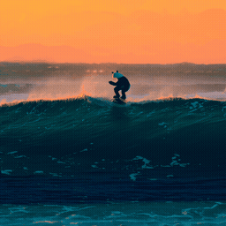

# mlx-diffuser

**Diffusion & flow models on Apple silicon, powered by [MLX](https://github.com/ml-explore/mlx).**
Train from scratch, fine-tune, or run inference — for image, video, and discrete
modalities — from one small, readable codebase.

[](https://pypi.org/project/mlx-diffuser/)
[](https://pypi.org/project/mlx-diffuser/)
[](https://pypi.org/project/mlx-diffuser/)
[](https://github.com/amirhossein-razlighi/mlx_diffuser/blob/main/LICENSE)
[](https://github.com/amirhossein-razlighi/mlx_diffuser/actions/workflows/ci.yml)
[](https://amirhossein-razlighi.github.io/mlx_diffuser/)

---

<table>
<tr>
<td align="center"></td>
<td align="center"></td>
</tr>
<tr>
<td align="center"><sub><em>"a red fox trotting through snow, cinematic"</em></sub></td>
<td align="center"><sub><em>"a panda surfing a big wave at sunset, cinematic"</em></sub></td>
</tr>
</table>

**WAN 2.1 (1.3B) text-to-video, generated end-to-end in MLX on Apple silicon** — see the
[WAN guide](https://amirhossein-razlighi.github.io/mlx_diffuser/guides/wan/).

<table>
<tr>
<td align="center"></td>
<td align="center"></td>
</tr>
<tr>
<td align="center"><sub><em>SDXL base — 1024×1024</em></sub></td>
<td align="center"><sub><em>FLUX.1-schnell — 1024², 4 steps, 4-bit</em></sub></td>
</tr>
</table>

<p align="center"><sub><em>"a majestic lion standing on a cliff at sunset, photorealistic, cinematic"</em></sub></p>

**Stable Diffusion XL** and **FLUX.1** text-to-image, the official weights running natively
in MLX — see the [SDXL guide](https://amirhossein-razlighi.github.io/mlx_diffuser/guides/sdxl/)
and the [FLUX guide](https://amirhossein-razlighi.github.io/mlx_diffuser/guides/flux/). The
12B FLUX.1 runs 4-bit and fits a 16 GB Mac.

**LTX-2.3** — Lightricks' 22B joint audio-video model — also runs natively: the ~94 GB
official release is *stream-converted* to ~20 GB of 4-bit MLX components (the originals
never touch disk) and generation is staged so a 16 GB Mac peaks at one component at a
time. See the [LTX-2.3 guide](https://amirhossein-razlighi.github.io/mlx_diffuser/guides/ltx2/).

---

If you know PyTorch and 🤗 `diffusers`, you already know this library:
`Model.from_pretrained(...)`, `pipe(...)`, `nn.Module` everywhere. The difference
is underneath — unified memory, `mx.compile`, fused Metal kernels, and built-in
weight quantization, so large models fit and run fast on a Mac.

## Install

```bash
pip install mlx-diffuser          # core
pip install "mlx-diffuser[hub]"   # + Hugging Face Hub loading
```

Requires Apple silicon (M-series) and Python 3.11+.

## Generate

```python
from mlx_diffuser import DiffusionPipeline

pipe = DiffusionPipeline.from_pretrained("path/or/hub-id", dtype="bf16", quantize=4)
images = pipe([1, 2, 3], num_inference_steps=50, guidance_scale=4.0, seed=0)
```

…or from the terminal:

```bash
mlx-diffuser generate path/or/hub-id --labels 1,2,3 --steps 50 --out samples/
```

## Train from scratch

```python
from mlx_diffuser import DiT, DiTConfig, DiffusionTrainer
from mlx_diffuser.schedulers import FlowMatchEulerScheduler
from mlx_diffuser.training import batch_iterator

model = DiT(DiTConfig(in_channels=3, hidden_size=384, depth=12, num_heads=6))
trainer = DiffusionTrainer(model, FlowMatchEulerScheduler(), lr=1e-4, ema_decay=0.999)
trainer.fit(batch_iterator(data, batch_size=32), steps=10_000)
model.save_pretrained("my-model")
```

## Fine-tune with LoRA (on your laptop)

```python
from mlx_diffuser import DiT, inject_lora, save_lora
from mlx_diffuser.schedulers import FlowMatchEulerScheduler
from mlx_diffuser import DiffusionTrainer

model = DiT.from_pretrained("my-model")
inject_lora(model, rank=8)                 # base frozen; only adapters train
trainer = DiffusionTrainer(model, FlowMatchEulerScheduler(), lr=5e-3)
trainer.fit(batch_iterator(data, batch_size=8), steps=1000)
save_lora(model, "my-lora", rank=8, alpha=16)
```

```bash
mlx-diffuser train --data ./photos --base my-model --lora --out my-lora --steps 1000
```

## What's inside

- **Models** — `DiT` (image/video/text via config), `UNet2D` (Stable-Diffusion
  style, text-conditionable), `AutoencoderKL` (VAE for latent diffusion).
- **Schedulers** — `DDPM`, `DDIM`, `EulerDiscrete`, `FlowMatchEuler`; one object
  covers both training (`add_noise`/`get_target`) and sampling (`step`).
- **Training** — `DiffusionTrainer` (compiled step, EMA, grad clip, min-SNR
  weighting), full fine-tune, and LoRA.
- **Apple-silicon speed** — fused attention, `mx.compile`, lazy evaluation,
  unified-memory controls, and 4/8-bit weight quantization.
- **CLI** — `generate`, `train`, `convert`.

## Design

The library rests on three orthogonal pieces — a **process** (the noise/flow math),
a **network** (a plain `nn.Module`), and a **pipeline** (inference glue). Keeping
them independent is what lets the same network train under DDPM today and
flow-matching tomorrow. See [DESIGN.md](DESIGN.md) and the
[documentation](https://AmirHossein-razlighi.github.io/mlx_diffuser/).

## License

Apache-2.0.
