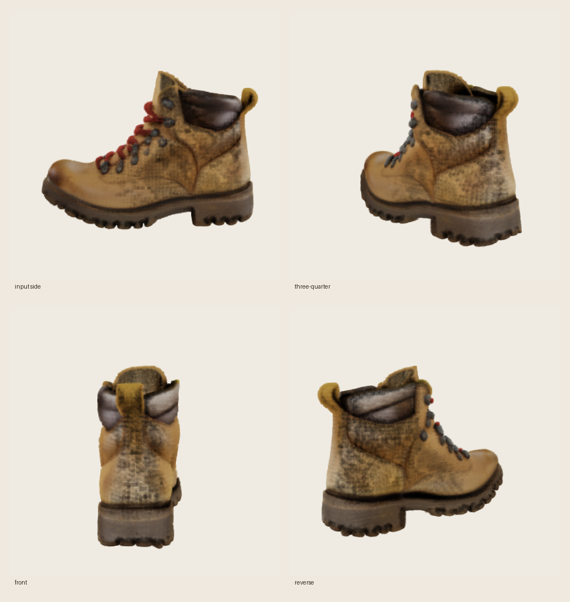

# TRELLIS image-to-3D

mlx-diffuser includes an **experimental native MLX port** of the image-conditioned
[Microsoft TRELLIS](https://github.com/microsoft/TRELLIS) pipeline. It accepts one
object image and exports a standard 3D Gaussian Splatting PLY without PyTorch, CUDA,
`spconv`, or `nvdiffrast`.

## Current support

| Stage | Native implementation |
| --- | --- |
| Image conditioning | DINOv2-large with registers, MLX attention |
| Sparse-structure generation | dense 16³ flow transformer + exact TRELLIS Euler/CFG schedule |
| Occupancy decoding | MLX Conv3D decoder, 16³ to 64³ |
| Structured latent generation | sparse SLAT flow transformer at 64³ |
| Representation decoding | sparse Swin Gaussian decoder |
| Export | standard 3D Gaussian PLY |

The mesh/FlexiCubes and radiance-field decoders, multi-image conditioning, and a native
Gaussian renderer are not included yet. The PLY is a splat representation, not a mesh.

## Verified sample

<table>
<tr>
<td align="center"></td>
<td align="center"></td>
</tr>
<tr>
<td align="center"><sub>synthetic photorealistic input</sub></td>
<td align="center"><sub>four depth-aware preview views of the generated PLY</sub></td>
</tr>
</table>

This is a real end-to-end run of the converted official checkpoints, not a mockup:

| Setting | Value |
| --- | --- |
| Hardware | MacBook Pro, M1 Pro (8-core), 16 GB unified memory |
| Checkpoint | `microsoft/TRELLIS-image-large` + DINOv2-with-registers-large |
| Seed | 42 |
| Sampling | 25 sparse-structure + 25 SLAT Euler steps |
| Converted precision | 8-bit DINOv2 and dense flow; FP16 sparse flow/decoders |
| Generation time | 202.36 seconds (checkpoint already converted) |
| MLX peak memory | 2.07 GB |
| Output | 433,408 Gaussians, 67 MB ASCII PLY |

The preview uses degree-zero SH color, sigmoid opacity, perspective projection, and a
depth-aware surface filter. It verifies recognizable geometry and unseen viewpoints,
but it is not a pixel-parity replacement for TRELLIS's CUDA anisotropic rasterizer.

## Install with uv

From a source checkout:

```bash
uv sync --extra trellis
```

As a dependency in another uv project:

```bash
uv add "mlx-diffuser[trellis]"
```

The extra installs `huggingface_hub`, which is needed only to fetch and convert the
official checkpoints. Runtime image processing uses Pillow from the core package.

## Generate a splat

A transparent PNG with one centered object works best:

```bash
uv run mlx-diffuser generate --model trellis \
  --image object.png \
  --download \
  --seed 42 \
  --out object.ply
```

`--download` is needed only the first time. It fetches the required official TRELLIS
and DINOv2 safetensors, converts them to MLX, and writes a staged checkpoint under
`checkpoints/trellis-image-large-mlx`. Later runs omit that flag.

For an opaque image, either remove the background before inference or install the
optional CPU background remover:

```bash
uv add "rembg[cpu]"
uv run mlx-diffuser generate --model trellis --image photo.jpg \
  --remove-background --out object.ply
```

## Python API

```python
from mlx_diffuser import TrellisImageTo3DPipeline
from mlx_diffuser.converters import download_and_convert_trellis

checkpoint = download_and_convert_trellis("checkpoints/trellis-image-large-mlx")
pipeline = TrellisImageTo3DPipeline.from_pretrained(checkpoint)
result = pipeline("object.png", seed=42)
result.save_ply("object.ply")
```

To convert already-downloaded official weights, use `convert_trellis_checkpoint(...)`
and pass the TRELLIS directory plus the DINOv2-with-registers directory. Conversion is
strict: missing or unexpected tensors fail instead of silently producing a partial model.

## Why it fits better on a Mac

The converted checkpoint is split into five independently loadable components:

1. DINOv2 image conditioner
2. dense sparse-structure flow model
3. occupancy decoder
4. sparse SLAT flow model
5. Gaussian decoder

The pipeline evaluates and releases each stage before loading the next. DINOv2 and the
dense structure flow are 8-bit by default; sparse features stay sparse rather than
materializing a 64³ feature volume; and low-memory mode evaluates each sparse transformer
block so MLX can release intermediate graphs promptly.

Sparse submanifold Conv3D runs through a fused custom Metal kernel. Coordinate topology
and neighbor maps are built and cached on the CPU, while all feature tensors and
multiply-accumulate work stay in MLX/Metal. A pure-MLX fallback remains available for
autodiff and is tested numerically against the Metal implementation.

!!! success "Official checkpoint verified"
    Strict conversion and a full 25 + 25-step inference have been verified on a 16 GB
    M1 Pro. The port remains experimental because component-by-component numerical
    parity against the PyTorch/CUDA reference and a native anisotropic renderer are
    still pending.

## Tuning

The official defaults are 25 sparse-structure steps and 25 SLAT steps. `--steps` changes
both together. Fewer steps are faster but may reduce geometry quality. CLI TRELLIS runs
always use staged low-memory evaluation; the Python API exposes `low_memory=False` for
benchmarking when more unified memory is available.
